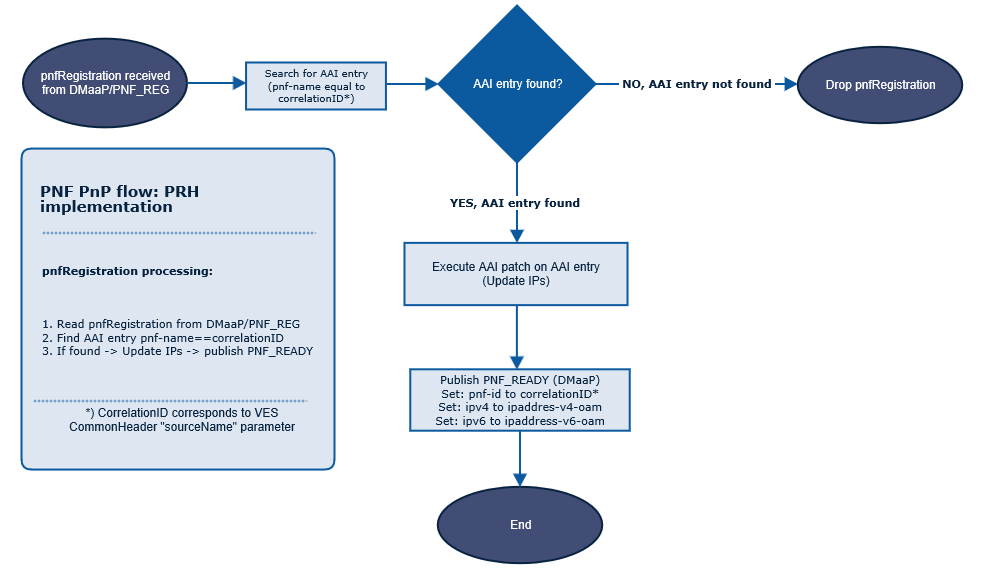

# PRH (PNF Registration Handler)

Physical Network Function Registration Handler is responsible for registration of PNF (Physical Network Function) to 
ONAP (Open Network Automation Platform) in plug and play manner. 

## Introduction 

PRH is delivered as one **Docker container** which hosts application server and can be started by `docker-compose`.

## Functionality

        
## Compiling PRH

Whole project (top level of PRH directory) and each module (sub module directory) can be compiled using 
`mvn clean install` command.   

## Main API Endpoints

Running with dev-mode of PRH

- **Heartbeat**: http://<container_address>:8100/**heartbeat** or https://<container_address>:8443/**heartbeat**

- **Start PRH**: http://<container_address>:8100/**start** or https://<container_address>:8433/**start**

- **Stop PRH**: http://<container_address>:8100/**stopPrh** or https://<container_address>:8433/**stopPrh**    

## Maven GroupId:

org.onap.dcaegen2.services

### Maven Parent ArtifactId:

dcae-services

### Maven Children Artifacts:
1. prh-app-server: Pnf Registration Handler (PRH) server
2. prh-commons: Common code for whole prh modules

## License

Copyright (C) 2018-2020 NOKIA Intellectual Property. All rights reserved.
[License](http://www.apache.org/licenses/LICENSE-2.0)

